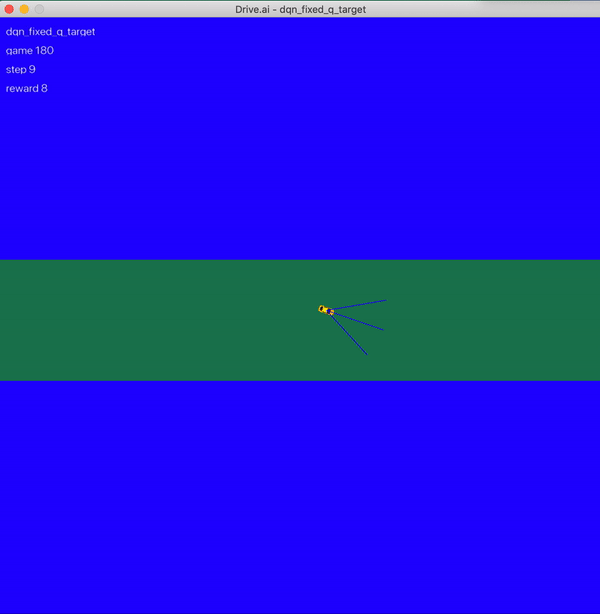
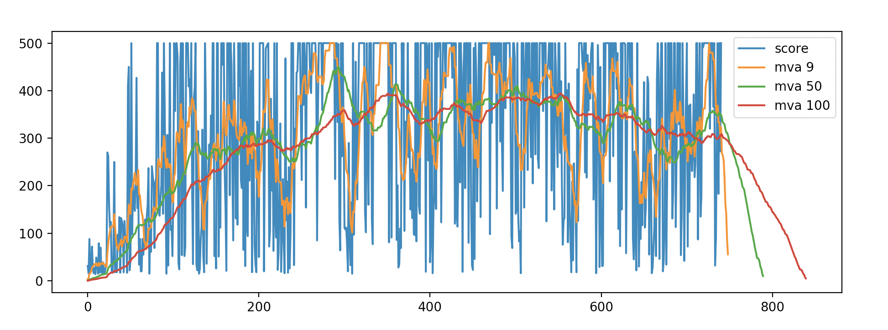

# Raspcar

I started this project to get a rapid overview of how autonomous vehicles work, in an extremely simplified manner. This readme is a simple chronological summary of my approach to the problem, with links to the various resources that helped me.

# Virtual simulation world

One of my goals was to implement some machine learning into my prototype. Aplpying it to object detection seemed like an interesting challenge. Since I did not have any form of training data, I wanted to try and implement a reinforcement learning algorithm: the Deep Q network (DQN) from [Deepmind](https://deepmind.com/research/dqn/) looked like a good fit.

To get a working implementation of this algorithm, I first had to create a virtual world to run my simulations in. It needed to be easily adaptable afterwards to fit as closely the real world conditions my prototype would evolve in. This would allow me to train the agent for as long as I needed in virtual conditions and transfer it on the prototype afterwards.

I built this virtual world using the following python gaming library:

- [Python Arcade](http://arcade.academy) - Python library for creating 2D video games.
- [Pygame](https://www.pygame.org/news) - alternative to Python Arcade.

# Reinforcement learning with DQNs

I then had to understand how DQNs work and implement my own algorithm. I did not reinvent the wheel here, so a lot of my inspiration comes from various blogs posts. [OpenAI's gym](https://gym.openai.com) environment was extremely useful to quickly get started with reinforcement learning, with virtual worlds, rewards and nice APIs already implemented for you. I added further improvements to the basic DQN implementation such as dueling networks, fixed Q-targets and stacked frames for the car input state to increase accuracy and reduce training time.
After only 200 iteration, the virtual car could succesfully elvolve in a world with 5 front facing sensors detecting the presence of objects.

Resources:

- [Deep Q-Learning with Keras and Gym](https://keon.io/deep-q-learning/)
- [Keras](https://keras.io)
- [Tensorflow](https://www.tensorflow.org)
- [Simple Reinforcement Learning with Tensorflow Part 4: Deep Q-Networks and Beyond](https://medium.com/@awjuliani/simple-reinforcement-learning-with-tensorflow-part-4-deep-q-networks-and-beyond-8438a3e2b8df)
- [Diving deeper into Reinforcement Learning with Q-Learning](https://www.freecodecamp.org/news/diving-deeper-into-reinforcement-learning-with-q-learning-c18d0db58efe/)
- [An introduction to Deep Q-Learning: let’s play Doom](https://www.freecodecamp.org/news/an-introduction-to-deep-q-learning-lets-play-doom-54d02d8017d8/)
- [Improvements in Deep Q Learning: Dueling Double DQN, Prioritized Experience Replay, and fixed Q-targets](https://www.freecodecamp.org/news/improvements-in-deep-q-learning-dueling-double-dqn-prioritized-experience-replay-and-fixed-58b130cc5682/)

Notes:

- getting the state / rewards right was more complicated than I expected it to be. At first, the state was only made of the radar sensor readings. This often lead the car to getting stuck into turning on itself in a wide enough space to not encounter any obstacle. While this did maximize the total reward, it did not achieve what I wanted it to and wander around in a never-ending world. To counter this phenomenon, I increased the reward when it kept going straight. This fixed the problem, but the car never really got to avoid obstacles smoothly. This was because it didn't have any knowledge of its prior state, if it was already turning to avoid an obstacle or not. I implemented the stacked frames technique so that the state was now made of the current and previous sensor readings. Performance boomed after that.

Turning onitself problem:

Final reward evolution over iterations:

# Lane detection with computer vision

I wanted to include some computer vision to my prototype. I used to see all those cool videos where machine learning algorithms detect objects on video feeds and draw boxes around them. I decided to implement the same for my project, and also add in lane detection. I am building a car after all. Once again, I learned a lot during my journey with a lot of help coming from already existing Github projects.

- [OpenCV](https://opencv.org)
- [car-finding-lanes-lines](https://github.com/naokishibuya/car-finding-lane-lines)

# Build a real world prototype

I had already built some robots during my engineering school years, and did build a small IOT arduino based device earlier, but this project was on a different scale. I did not really know where to start, I knew about Raspberry Pi, and bought one without hesitating. I mean look at the price of these and the diversity of projects they give you access to: it couldn't be a poor investment.

This revealed itself a lot easier than I expected it to be. I simply installed the [Raspbian](https://www.raspbian.org) linux flavor, and found myself in familiar territories. I got python working, compiled Opencv to process image input and started developping the software that would control my future car prototype.

During the process, I had the opportunity to learn a lot about real-time programming, distributed systems with [zmq](http://zeromq.org), implement various messaging patterns and do a lot of threading.

Resources:

- [Compile Opencv on raspberry pi](https://www.pyimagesearch.com/2018/09/26/install-opencv-4-on-your-raspberry-pi/)
- [Use raspberry pi camera](https://www.pyimagesearch.com/2015/03/30/accessing-the-raspberry-pi-camera-with-opencv-and-python/)

# Add a live monitoring dashboard

I had a running script running on a headless Raspberry. This was great, but I needed a way to monitor the evolution of my car: what was it seeing ? Did it detect objects correctly ? And the lanes ? Are the radars workings correctly ? How long has it been running for ?

To solve this, I added a webserver ([aiohttp](https://aiohttp.readthedocs.io/en/stable/)) running on my computer to which the car would constantly stream data to and display it in a realtime updated dashboard. I played a lot with [sockets](https://en.wikipedia.org/wiki/Unix_domain_socket), [websockets](https://en.wikipedia.org/wiki/WebSocket), [socket.io](https://socket.io), [zmq](http://zeromq.org) and asynchronous python programming. 

The dashboard is in [Vue.js](https://vuejs.org).

Resources: 
- MJPEG video streaming: [this](https://stackoverflow.com/questions/51130490/decode-video-frame-encoded-by-python-to-display-in-node-based-webapp/51131918#51131918), [this](https://picamera.readthedocs.io/en/release-1.13/recipes2.html#web-streaming), [this](https://github.com/crizCraig/mjpg_server_test/blob/master/asyncio_stream.py) and [this](https://gist.github.com/jbn/fc90e3ddbc5c60c698d07b3df30004c8)
- [Python asyncio](https://docs.python.org/3/library/asyncio.html)